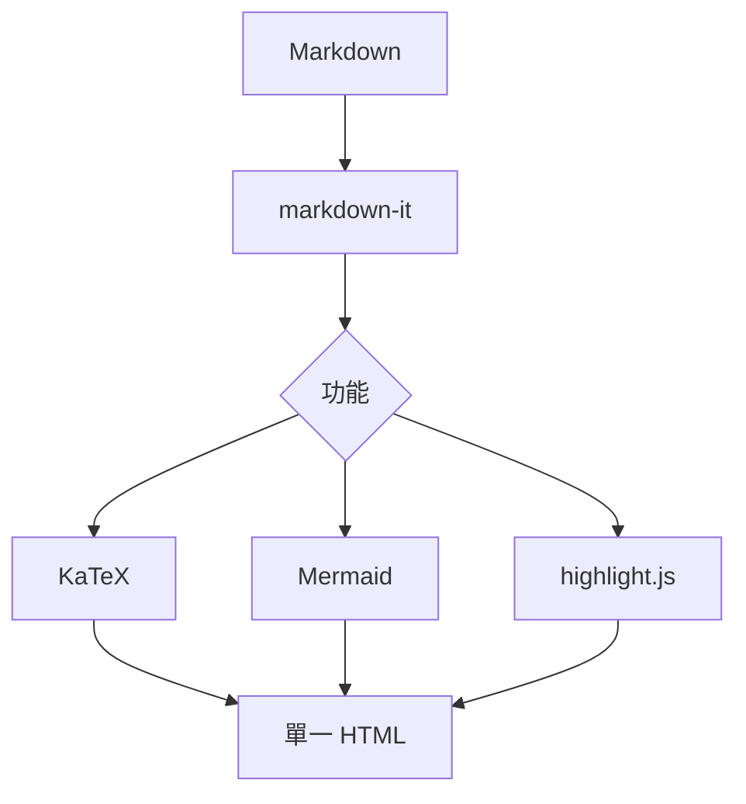

# Tarmdas 功能示範

這是一份涵蓋全部功能的示範文件，用來驗證離線轉檔結果
每個標題滑入時左側會浮現可點擊的錨點（`#`），下方目錄也會連到對應段落

## 目錄

[[toc]]

## 文字與清單

- 支援 **粗體**、_斜體_、`行內程式碼`、~~刪除線~~
- 支援 [連結](https://example.com) 與裸網址自動連結 https://example.com
- 巢狀清單
  1. 第一項
  2. 第二項

> 區塊引用：完全離線、單一 HTML 檔

## 任務清單

- [x] 已完成的項目
- [x] 支援大小寫 `[X]`
- [ ] 尚未完成的項目
- [ ] 巢狀任務
  - [x] 子任務（已完成）
  - [ ] 子任務（未完成）

## 延伸行內語法

- 高亮標示：這是 ==需要強調的重點==
- 上標與下標：面積 = πr^2^、水分子 H~2~O、二氧化碳 CO~2~
- 插入內容：這段是 ++後來新增的文字++
- 縮寫（游標移上去看說明）：HTML 與 CSS 是網頁的基礎
- Emoji 短碼：建置完成 :rocket: 測試通過 :white_check_mark: 慶祝一下 :tada:

*[HTML]: HyperText Markup Language
*[CSS]: Cascading Style Sheets

## 定義清單

Markdown
: 一種輕量級標記語言，以純文字撰寫、可轉為 HTML

Tarmdas
: 本地、完全離線的 Markdown 轉單一 HTML 工具

## 腳註

正文中可加入腳註參照[^1]，也支援具名腳註[^offline]，內容會匯整到頁面底部

[^1]: 這是第一個腳註的內容

[^offline]: Tarmdas 產出的單檔可用 `file://` 直接離線開啟

## 警示區塊（GitHub Alerts）

> [!NOTE]
> 一般補充說明

> [!TIP]
> 建議採用的做法或小撇步

> [!IMPORTANT]
> 重要事項，請務必閱讀

> [!WARNING]
> 警告：可能造成非預期結果

> [!CAUTION]
> 危險操作，後果自負

## 自訂容器

自訂容器會輸出帶 `custom-block-<名稱>` 類別的區塊，可用 `--css` 針對性設定樣式：

:::tip 小提示
容器內仍可使用 **粗體**、`行內程式碼` 等一般 Markdown 語法
:::

:::details 補充細節
適合放置可選讀的延伸說明
:::

## 表格

| 功能     | 狀態 |
| -------- | ---- |
| Markdown | OK   |
| KaTeX    | OK   |
| Mermaid  | OK   |

## 程式碼高亮

```js
function greet(name) {
  return `Hello, ${name}!`;
}
console.log(greet('Tarmdas'));
```

```python
def add(a, b):
    return a + b
```

## 數學（KaTeX）

行內數學：質能等價 $E = mc^2$

區塊數學：

$$
\int_{-\infty}^{\infty} e^{-x^2}\,dx = \sqrt{\pi}
$$

## Mermaid 圖



## 圖片

向量圖（SVG，內聯）：


點陣圖（PNG，Base64 內嵌）：


