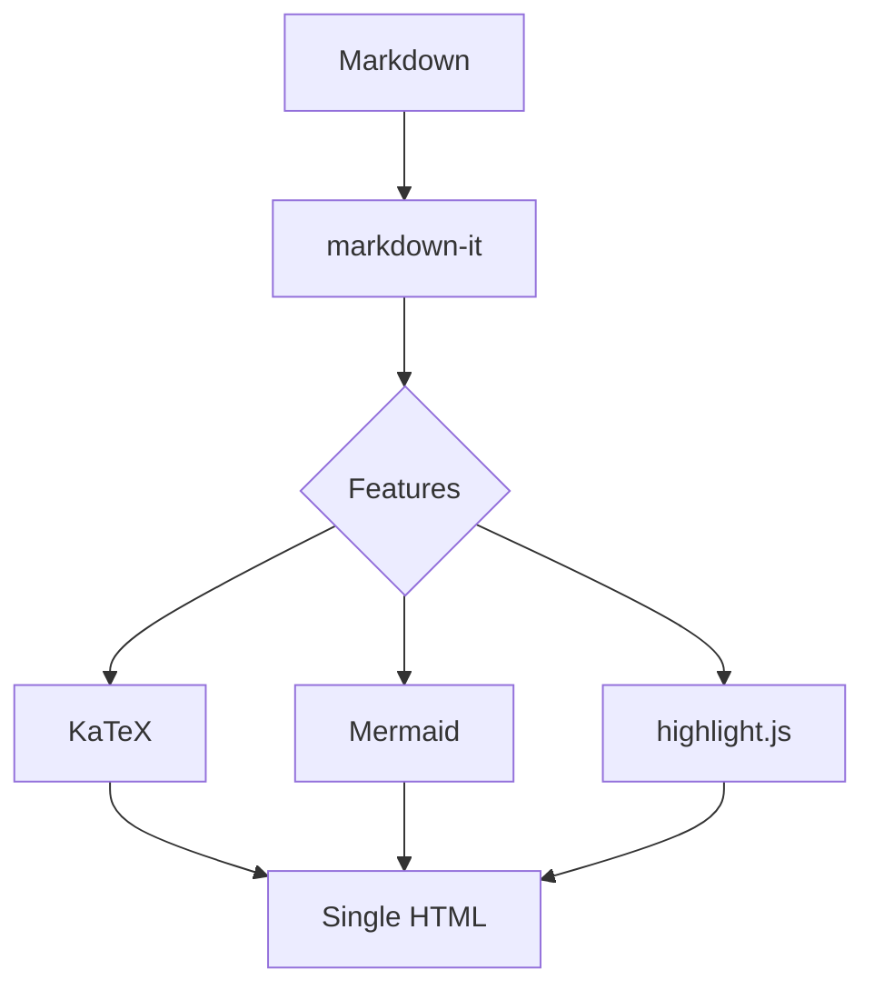

# Tarmdas Feature Showcase

This document exercises every feature, to verify the offline conversion result.
Hover any heading to reveal a clickable anchor (`#`) on the left; the table of contents below also links to each section.
A heading can pin a stable id with a trailing `{#id}` marker (see "Extended Inline Syntax" below, which resolves to `#inline-syntax`), so the anchor survives any later edits to its text.

## Table of Contents

[[toc]]

## Text and Lists

- Supports **bold**, _italic_, `inline code`, ~~strikethrough~~
- Supports [links](https://example.com) and bare-URL autolinking https://example.com
- Nested lists
  1. First item
  2. Second item

> Blockquote: fully offline, single HTML file

## Task Lists

- [x] A completed item
- [x] Uppercase `[X]` is supported
- [ ] A pending item
- [ ] Nested tasks
  - [x] Subtask (done)
  - [ ] Subtask (pending)

## Extended Inline Syntax {#inline-syntax}

- Mark: this is ==a point worth emphasizing==
- Superscript and subscript: area = πr^2^, water H~2~O, carbon dioxide CO~2~
- Insert: this part was ++added later++
- Abbreviations (hover for the tooltip): HTML and CSS are the foundation of the web
- Emoji shortcodes: build done :rocket: tests pass :white_check_mark: celebrate :tada:

*[HTML]: HyperText Markup Language
*[CSS]: Cascading Style Sheets

## Definition Lists

Markdown
: A lightweight markup language, written as plain text and convertible to HTML

Tarmdas
: A local, fully offline Markdown to single-HTML converter

## Footnotes

Body text can reference footnotes[^1], named footnotes work too[^offline]; their content is collected at the bottom of the page.

[^1]: This is the first footnote's content

[^offline]: A file produced by Tarmdas opens offline directly via `file://`

## Alert Blocks (GitHub Alerts)

> [!NOTE]
> General supplementary information

> [!TIP]
> A recommended approach or handy trick

> [!IMPORTANT]
> Important information, please read carefully

> [!WARNING]
> Warning: may cause unexpected results

> [!CAUTION]
> Dangerous operation, proceed at your own risk

> [!DATE]
> 2026-06-06 — a non-standard type for highlighting a date or timestamp

> [!DATE] Last updated: 2026-06-06
> A label on the marker line replaces the default "Date" title

## Custom Containers

Custom containers emit a block with a `custom-block-<name>` class, which you can style via `--css`:

:::tip Hint
Regular Markdown such as **bold** and `inline code` still works inside containers
:::

:::details More details
A good place for optional, skippable elaboration
:::

## Tables

| Feature  | Status |
| -------- | ------ |
| Markdown | OK     |
| KaTeX    | OK     |
| Mermaid  | OK     |

## Code Highlighting

```js
function greet(name) {
  return `Hello, ${name}!`;
}
console.log(greet('Tarmdas'));
```

```python
def add(a, b):
    return a + b
```

## Math (KaTeX)

Inline math: mass-energy equivalence $E = mc^2$

Block math:

$$
\int_{-\infty}^{\infty} e^{-x^2}\,dx = \sqrt{\pi}
$$

## Mermaid Diagram



## Images

Vector (SVG, inlined):


Raster (PNG, Base64-embedded):


