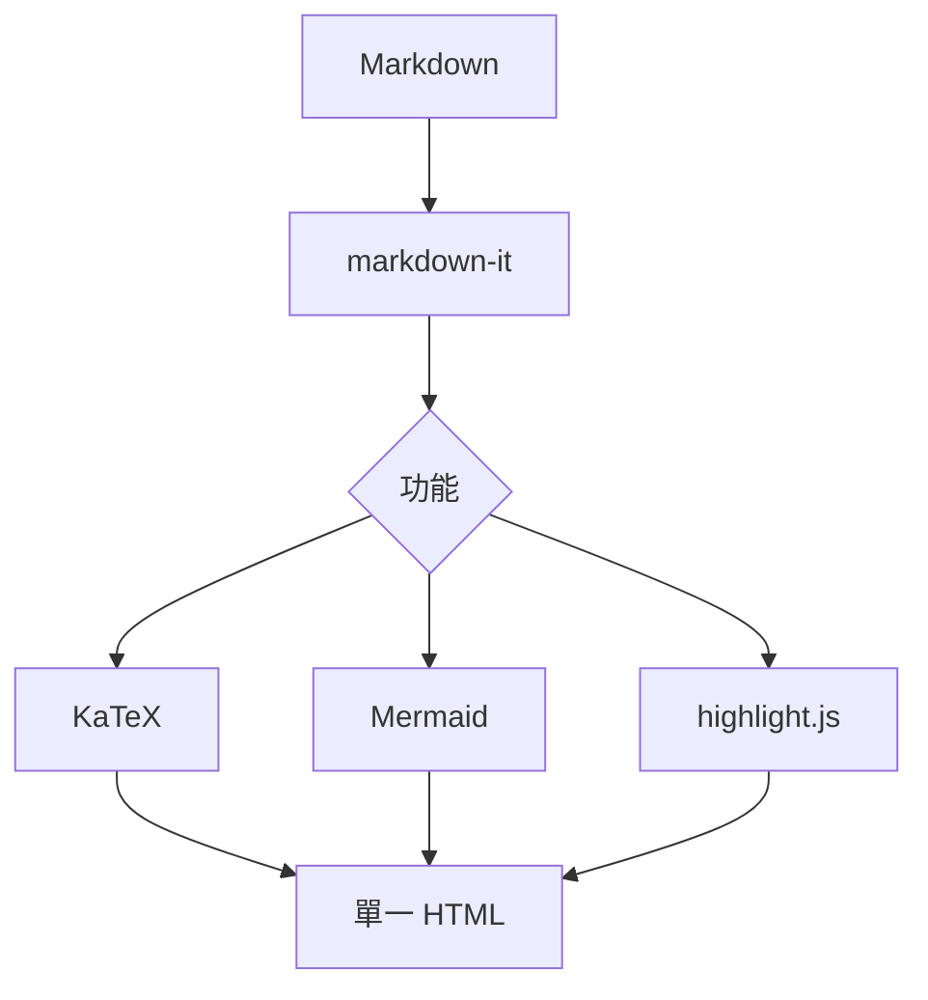

# Tarmdas 功能示範

這是一份涵蓋全部功能的示範文件，用來驗證離線轉檔結果

## 文字與清單

- 支援 **粗體**、_斜體_、`行內程式碼`
- 支援 [連結](https://example.com)
- 巢狀清單
  1. 第一項
  2. 第二項

> 區塊引用：完全離線、單一 HTML 檔

## 警示區塊（GitHub Alerts）

> [!NOTE]
> 一般補充說明

> [!TIP]
> 建議採用的做法或小撇步

> [!IMPORTANT]
> 重要事項，請務必閱讀

> [!WARNING]
> 警告：可能造成非預期結果

> [!CAUTION]
> 危險操作，後果自負

## 表格

| 功能     | 狀態 |
| -------- | ---- |
| Markdown | OK   |
| KaTeX    | OK   |
| Mermaid  | OK   |

## 程式碼高亮

```js
function greet(name) {
  return `Hello, ${name}!`;
}
console.log(greet('Tarmdas'));
```

```python
def add(a, b):
    return a + b
```

## 數學（KaTeX）

行內數學：質能等價 $E = mc^2$

區塊數學：

$$
\int_{-\infty}^{\infty} e^{-x^2}\,dx = \sqrt{\pi}
$$

## Mermaid 圖



## 圖片

向量圖（SVG，內聯）：


點陣圖（PNG，Base64 內嵌）：


